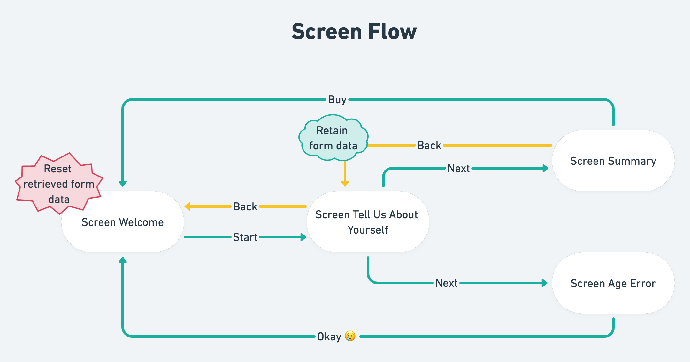
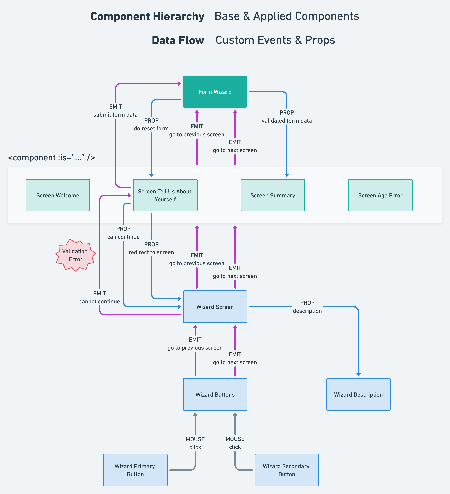

# Solution

## Technical Choices

### Vue 3, TypeScript, Tailwind CSS, Vite

Project is built in Vue 3 with TypeScript and Tailwind CSS and is built by Vite.

### Composition API only

All components are written in Composition API via `<script setup>` Single File Components.

### Rigorous use of TypeScript

All types are exhaustively, tightly and explicitly defined whenever possible to serve as self-documentation and provide reassurance with the compile time type-checking provided by TypeScript language server.

### No Vue Router and Vuex to allow reusability

A deliberate decision was made to _not_ use Vue Router and Vuex. This is possible by exploiting unique features of Vue:

- `<keep-alive />` to cache form data
- `<component :is="…" />` to switch between screens without routing and render different types of buttons dynamically
- `defineAsyncComponent(() => import(…))` to lazy load the components only when it's needed
- emitting custom events to parent component to allow easy upward data flow, eliminating the need for Vuex

The dependencies of `FormWizard.vue` is minimized to just Vue 3 and Tailwind CSS, allowing it to be _reusable_ and easy to embed in other projects.

### Separation of business and generic logic

The components in the `src/components/applied` handles the _project-specific_, i.e., business logic while the components in `src/components/base` handles _potentially reusuable, generalized_ logic.

## Architecture






## Approach

### Base `WizardScreen.vue`

#### Code Sharing

After analyzing the given [mockups](https://miro.com/app/board/o9J_laOKpgA=/?invite_link_id=541065843186), the following commonalities were found amongst all four screens:

- Title
- Description
- Row of buttons

Two screens, _Tell Us About Yourself_ and _Summary_, have different centerpiece. The solution was to devise a base `WizardScreen.vue` with a Vue `<slot>` to accomodate different centerpiece while the common parts are populated by `props`

```html
<template>
  <div
class="flex flex-col items-center gap-6 border border-gray-200 bg-gray-50 rounded-lg shadow-sm p-6"
  >
<h1 class="text-2xl font-bold text-gray-700">
  {{ title }}
</h1>

<WizardDescription v-if="description.length" :description="description" />

<!-- Host centerpiece here -->
<slot />

<div v-if="buttons.length" class="flex gap-4">
  <WizardButtons
    @go-to-previous-screen="goToPreviousScreen($event)"
    @go-to-next-screen="goToNextScreen($event)"
    :buttons="buttons"
  />
</div>
  </div>
</template>
```

#### Configuration Driven

The following are the `props` for `WizardScreen.vue`

```typescript
export const ScreenWelcome: WizardScreenConfiguration = {
  title: 'Hello There!',
  description: [
"Let's buy some insurance. It's only going to take a few steps!",
  ],
  buttons: [
{
  type: 'Primary',
  label: 'Start',
  eventName: 'goToNextScreen',
  screenName: 'ScreenTellUsAboutYourself',
},
  ],
};
```

This approach allows separation of code from data, allowing us to quickly create four screens in a DRY manner and avoiding as much one-off code as possible.

#### Conditional Screen Navigation

`WizardScreen.vue` also acts as a traffic controller liaising between the _applied_ screen components and topmost parent `FormWizard.vue`. It handles conditional screen navigation based on `canContinue` and `redirectToScreen` props.

If `canContinue` tells it to cancel the default navigation, it emits a `cannotContinue` event to the _applied_ screen component, specifically to `ScreenTellUsAboutYourself.vue`, to trigger built-in browser form validations.

### `WizardButtons.vue`

This is the hub where custom events for navigating between screens are emitted. The type of button, event to emit and the screen to navigate to are dynamically furnished by each screen's `WizardScreenConfiguration`.

```html
<template>
  <template v-for="(button, index) in buttons" :key="`button-${index}`">
<!-- REF: https://v3-migration.vuejs.org/new/fragments.html#_3-x-syntax -->
<component
  v-bind="$attrs"
  :is="buttonComponents[button.type]"
  class="bg-teal-300 py-4 px-16 rounded-lg font-semibold uppercase"
  type="button"
  @click="emit(button.eventName, button.screenName)"
>
  {{ button.label }}
</component>
  </template>
</template>
```

This approach allows `WizardPrimaryButton.vue` and `WizardSecondaryButton` to focus only on styling and contains no logic within.

### `FormWizard.vue`

This is the topmost parent component.

- It receives validated form data from `ScreenTellUsAboutYourself.vue` and passes it to `ScreenSummary`
- If wizard flow is restarted, it resets the validated form data
- It tells `ScreenTellUsAboutYourself.vue` whether to reset or retain form data
- It handles the lazy loading of next or previous screen according to `goToNextScreen` and `goToPreviousScreen` events emitted from `WizardScreen.vue`

### `SummaryTellUsAboutYourself.vue`

- The hidden input field in the form is programmatically populated with final premium calculation for inclusion in the form data
- The hidden submit button in the form is used trigger browser form validation programmatically when it receives the `cannotContinue` custom event
- `FormData()` is instantiated from HTML form element to retrieve form field values when the `change` event listener is fired
- All of the logic relating to premium calculation and form validation took the form of Vue's reactive computed properties used to derive
- currency and currrency rate from country selected
- base premium calculation from age and currency rate
- additional premium calculation for different packages
- render additional premium dynamically in the package options presented
- final premium calculation
- check whether all fields are filled
- check whether age is within insurable range
- transform form data into an object of key-value pairs for use in `ScreenSummary.vue`